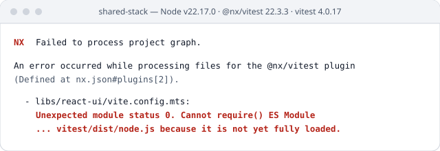
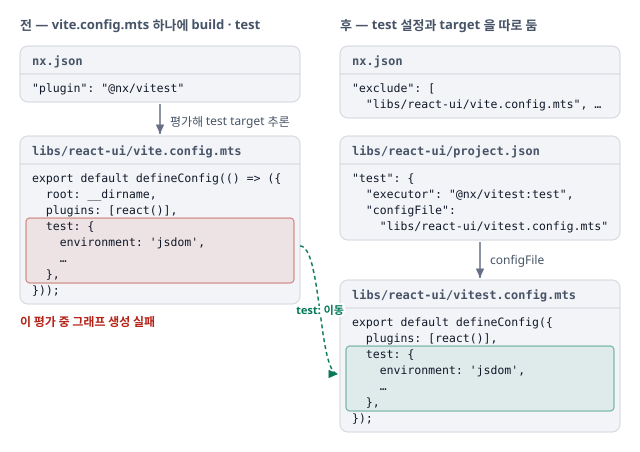

# Nx 그래프 생성 중 @nx/vitest 플러그인의 ESM require 경쟁 상태

프로젝트 그래프를 만들 때 `@nx/vitest` 추론 플러그인이 `vite.config.mts` 를 평가하다, 같은 Vitest ESM 모듈을 `import()` 와 `require()` 가 동시에 읽으며 부딪혀 실패. 해당 파일을 플러그인에서 빼고, test 설정을 `vitest.config.mts` 로 떼어 test target 을 직접 적음.

## 증상

- 환경(작성자 메모 기준) — Node v22.17.0, `@nx/vitest@22.3.3`, `vitest@4.0.17`. 대상은 test 설정이 들어 있던 `libs/react-ui/vite.config.mts`
- Nx 가 프로젝트 그래프를 만드는 단계에서 `nx.json#plugins[2]`(`@nx/vitest`)가 실패
- 핵심 메시지 — `Unexpected module status 0. Cannot require() ES Module ... vitest/dist/node.js because it is not yet fully loaded`. Node 내부 이슈 · 경쟁 상태 가능성을 함께 알림

## 원인

Nx 가 그래프를 만들며 같은 Vitest 모듈을 두 방식으로 동시에 읽다 부딪힘. 테스트 실행이 아니라 설정 파일을 해석하는 단계의 문제.

1. **Nx 가 설정 파일을 열어 봄** — 명령을 실행하기 전에 그래프를 만들며 `@nx/vitest` 가 프로젝트마다 `vite.config.mts` 를 평가
2. **`test:` 블록이 Vitest 를 부름** — 블록이 있으면 Vitest 설정으로 다뤄 `vitest/dist/node.js` 를 불러옴
3. **두 방식으로 동시에 읽음** — 여러 프로젝트를 병렬로 처리하며 이 모듈을 `import()` 로 읽는 중에 `require()` 로도 읽음
4. **Node 22 가 에러로 냄** — 22.12.0 부터 `require(esm)` 가 기본으로 켜져, 다 읽히지 않은 ESM 모듈을 `require()` 하면 실패

## 반영

- 플러그인을 통째로 지우지 않고 `test:` 블록이 있던 두 파일(react-ui · ui-core 의 `vite.config.mts`)만 `nx.json` 에서 exclude
- test 설정은 `vitest.config.mts` 로 옮기고, test target 은 `project.json` 에 직접 적음

## 참고자료

- [nrwl/nx#34028](https://github.com/nrwl/nx/issues/34028) — Nx. 같은 에러를 다룬 이슈. 설치된 `@nx/vitest` 23.2.1 은 설정 파일을 평가하기 전에 `import("vitest/node")` 를 먼저 끝내는 우회를 둠. 당시 버전(22.3.3)에 이 우회가 있었는지는 확인하지 못함
- [Node.js 22.12.0 (LTS)](https://nodejs.org/en/blog/release/v22.12.0) — Node.js. v22.x 에서 `require(esm)` 가 플래그 없이 켜짐. 문제가 생기면 `--no-experimental-require-module` 로 끌 수 있음
