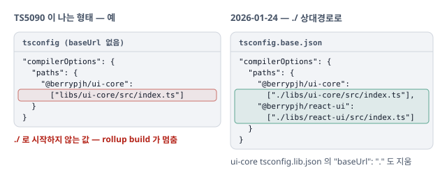

# rollup build 설정 중 TS5090 — baseUrl 을 걷어내고 paths 를 상대경로로

react-ui 의 rollup build 를 설정하다 TS5090 으로 멈춤. `baseUrl` 을 지우고 루트 `paths` 를 `./` 상대경로로 적음. 이후 TypeScript 6 이 `baseUrl` 을 deprecated 하자 rollup 전용 tsconfig 에 남은 `baseUrl` 도 걷어냄.

## 증상

- react-ui 의 rollup build 를 `@rollup/plugin-typescript` 로 설정하는 중 TS5090 으로 build 가 멈춤(작성자 메모). 당시 TypeScript 는 `~5.9.2`

## 원인

`baseUrl` 이 없으면 `paths` 값은 tsconfig 기준 상대경로여야 함.

- **TS5090 조건** — `baseUrl` 이 없는데 `paths` 값이 `./` · `../` 로 시작하지 않으면(예: `libs/ui-core/src/index.ts`) 멈춤. TS 4.1 부터 `paths` 에 `baseUrl` 이 필요 없어지며 `paths` 를 tsconfig 파일 기준으로 풂
- **`baseUrl` 은 두 역할을 함께 함** — `paths` 의 기준 경로이면서 그 밖의 bare import(`import "blah.js"`)를 푸는 추가 지점. 원치 않는 위치에서 모듈이 잡히는 함정 때문에 TypeScript 는 6.0 에서 deprecated, 7.0 에서 제거
- **rollup 단계에서 드러남** — `@rollup/plugin-typescript` 가 tsconfig(`extends` 결과 포함)의 `compilerOptions` 를 읽어 컴파일함

## 반영

`baseUrl` 을 걷어내고, `paths` 는 루트 한 곳에 `./` 상대경로로.

- **루트 `tsconfig.base.json`** — `paths` 를 `./libs/...` 상대경로로 추가. `baseUrl` 없음
- **ui-core `tsconfig.lib.json`** — `baseUrl: "."` 삭제
- **이후 TypeScript 6(2026-09-16)** — `typescript` 가 `~6.0.3` 으로 오른 직후 react-native-ui `tsconfig.rollup.json` 의 `baseUrl: "../.."` · `paths` 를 지우고 `paths: {}`, react-ui `tsconfig.rollup.json` 도 `paths: {}`. TypeScript 는 같은 날 `~5.9.3` 으로 되돌림

## 참고자료

- [Deprecate, remove support for `baseUrl` #62207](https://github.com/microsoft/TypeScript/issues/62207) — TypeScript. 6.0 에서 deprecated. `"@app/*": ["app/*"]` 를 `["./src/app/*"]` 로, 필요하면 `"*": ["./src/*"]` catch-all
- [Progress on TypeScript 7 - December 2025](https://devblogs.microsoft.com/typescript/progress-on-typescript-7-december-2025/) — TypeScript Blog. TS 5.9 대비 7 의 차이로 `--baseUrl` 제거를 듦. `ts5to6 --fixBaseUrl` 로 tsconfig 를 고칠 수 있음
- [baseUrl](https://www.typescriptlang.org/tsconfig/#baseUrl) — TSConfig Reference. 브라우저 AMD 로더용으로 설계돼 다른 맥락에서는 권장하지 않음. `paths` 는 `baseUrl`, 없으면 tsconfig 파일 기준으로 풂
- [TypeScript 4.1 — paths without baseUrl](https://www.typescriptlang.org/docs/handbook/release-notes/typescript-4-1.html) — TypeScript Handbook. `paths` 에 `baseUrl` 이 필요 없어짐
- [@rollup/plugin-typescript](https://github.com/rollup/plugins/tree/master/packages/typescript) — rollup/plugins. 기본으로 `tsconfig.json` 을 읽고, `tsconfig` 옵션으로 읽을 파일을 지정
- [NX-generated tsconfig uses deprecated baseUrl #32958](https://github.com/nrwl/nx/issues/32958) — Nx. `baseUrl: "."` 과 non-relative `paths` 가 최신 도구에서 TS5090 · TS5102 를 냄. `./packages/...` 로 고치면 해결
- [Complains about relative paths in "paths" #1713](https://github.com/microsoft/typescript-go/issues/1713) — typescript-go. non-relative `paths` 를 거부하고, `./` 를 붙이면 해석이 깨지는 사례
