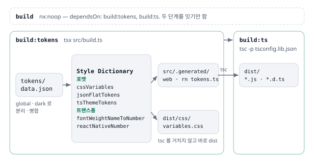

# design-tokens 를 Style Dictionary 생성과 tsc 로 빌드

토큰 JSON 을 Style Dictionary 로 플랫폼별 산출물로 바꾸는 `build.ts` 를 먼저 돌리고, 그 결과인 TS 토큰 모듈을 tsc 로 컴파일해 `exports` 가 가리키는 `dist` 의 JS · `.d.ts` 를 냄.

## 상황

- 토큰 원본 하나로 웹 CSS 변수와 Web · RN 테마 토큰을 모두 만들어야 함
- 이날 `build.ts` 빌드 스크립트(`64fae16`), Style Dictionary 파이프라인과 커스텀 포맷 · 트랜스폼(`8fc4b3b`), 타입스크립트 컴파일 단계(`bc5d500`)가 차례로 들어옴

## 판단

- **생성은 Style Dictionary** — CSS Variables · JSON Flat · TypeScript 테마 토큰을 커스텀 포맷으로, fontWeight · RN 숫자 값을 커스텀 트랜스폼으로 만듦(`8fc4b3b`)
- **컴파일은 번들러 없이 tsc** — Style Dictionary 가 만든 것은 `src/.generated/` 의 TS 토큰 모듈이고, `src/web.ts` · `src/rn.ts` 가 이를 다시 내보냄. `package.json` `exports` 의 `.` · `./web` · `./rn` 은 `dist/index.js` · `web.js` · `rn.js` 와 각 `.d.ts` 를 가리킴. `tsc -p tsconfig.lib.json` 이 `src/index.ts` 에서 출발해 파일마다 JS 와 `.d.ts` 를 그대로 내 이 자리를 채움. CSS 는 `build.ts` 가 `dist/css` 에 바로 써 컴파일할 것이 없음
- **build 는 두 단계를 잇는 noop** — `build:ts` 가 `build:tokens` 에 기댐

