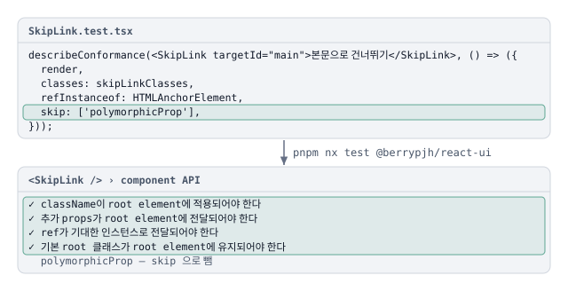

# react-ui 컴포넌트마다 같은 API 계약을 describeConformance 로 검사

컴포넌트 테스트가 className · 추가 props · ref · root 클래스 · polymorphic 을 각자 다르게 확인하지 않게, 공통 스위트 `describeConformance` 와 렌더러 `createRenderer` 를 둠. 컴포넌트는 최소 요소와 옵션만 넘김.

## 상황

- react-ui 컴포넌트는 모두 같은 공개 API 약속을 지켜야 함 — 소비자가 준 `className` 을 root 에 합치고, 나머지 props 를 root 에 넘기고, `ref` 를 root 요소로 전달함
- 컴포넌트마다 이것을 손으로 테스트하면 빠지는 항목이 생기고 문구 · 방식이 제각각이 됨
- 첫 컴포넌트 `ButtonBase` 를 만들며 테스트 환경을 함께 정비함

## 판단

공통 계약은 스위트 하나가 정의하고, 컴포넌트는 최소 요소와 옵션만 넘김.

| 계약              | 확인하는 것                                                      |
| ----------------- | ---------------------------------------------------------------- |
| `mergeClassName`  | 준 `className` 이 root 에 붙음                                   |
| `propsSpread`     | 추가 props 가 root 에 전달됨                                     |
| `refForwarding`   | `ref` 가 `refInstanceof` 로 준 인스턴스(예: `HTMLButtonElement`) |
| `rootClass`       | 기본 root 클래스(`classes.root`)가 유지됨                        |
| `polymorphicProp` | `component` · `as` 로 다른 root 요소를 그림                      |

- **해당 없는 항목만 명시적으로 뺌** — `skip` 또는 `only`. 필요한 옵션이 없으면 실패로 알려 줌(예: "conformance 옵션에 refInstanceof 가 없습니다")
- **렌더는 `createRenderer` 로** — 기본 `StrictMode` 로 감싸고, `user`(userEvent) · `setProps` · `setPropsAsync` · `forceUpdate` 를 함께 돌려줌. prop 을 바꿔 다시 그리는 테스트를 같은 방식으로 씀
- **prop 패턴을 바꾸면 스위트도 고침** — 계약이 바뀌었는데 스위트가 그대로면 모든 컴포넌트가 옛 계약으로 통과함

**계약은 한 곳에 — 컴포넌트 테스트는 "무엇이 다른가"만 적음.**

## 반영

- **스위트 · 렌더러** — `test-utils/describeConformance.tsx` 와 `test/createRenderer.tsx`, `vitest.setup.ts`. 첫 적용은 `ButtonBase`
- **root 선택 옵션** — root 가 컨테이너의 첫 자식이 아닌 컴포넌트를 위해 `getRootElement` 옵션
- **적용 범위** — 컴포넌트 테스트 파일 31개 중 28개가 이 스위트를 씀. 쓰지 않는 셋은 `Popover` · `SearchField` 와 `FormControl` 통합 테스트

## 검증

- `pnpm nx test @berrypjh/react-ui` 가 스위트를 돌림. 지침은 `.claude/rules/react-ui.md`("prop 패턴을 바꾸면 `test-utils/describeConformance` 도 갱신")

## 참고자료

- [About Queries](https://testing-library.com/docs/queries/about/) — Testing Library. 요소를 찾는 쿼리의 우선순위 — 접근성 트리의 역할 · 이름으로 찾는 `getByRole` 이 첫째
- [user-event](https://testing-library.com/docs/user-event/intro/) — Testing Library. `fireEvent` 보다 실제 사용자 상호작용에 가깝게 이벤트를 일으킴. `createRenderer` 가 `userEvent.setup()` 을 함께 줌
- [`<StrictMode>`](https://react.dev/reference/react/StrictMode) — React. 개발 중 렌더 · effect 를 한 번 더 돌려 순수하지 않은 코드를 드러냄. `createRenderer` 의 기본값
