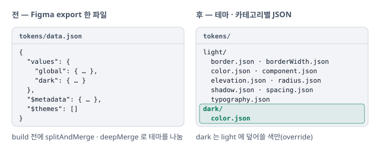

# 토큰 원본을 Figma export 에서 직접 쓰는 JSON 으로

Figma 에서 내보낸 토큰 JSON 을 받아 변환하던 흐름을 버리고, 테마 · 카테고리별 JSON 을 저장소에서 직접 씀.

## 상황

- 처음 구조는 Figma 에서 export 한 토큰 JSON 을 받아 CSS · JS 객체 · Tailwind preset 등 여러 소비처에 맞게 변환하는 것
- 토큰은 `tokens/data.json` 한 파일에 모여 있었고, build 전에 `splitAndMerge` · `deepMerge` 전처리로 테마를 나눔
- 작업하다 보니 Figma 를 거의 쓰지 않음. 토큰 하나를 고치려고 Figma 를 열고, 플러그인을 돌리고, 다시 export 하는 절차가 작은 수정에도 끼어듦

## 판단

토큰 원본을 저장소의 JSON 으로 옮기고, 그 JSON 을 라이브러리 · 환경별로 변환.

- **파일은 테마 · 카테고리별로** — Figma 한 덩어리 대신 `tokens/<테마>/<카테고리>.json`. 테마 차이는 전처리 대신 Style Dictionary 의 source glob 과 override 로 표현함

## 반영

- **파일 분할** — `tokens/data.json` 을 `tokens/{light,dark}/{category}.json` 으로 나누고 `splitAndMerge` · `deepMerge` 전처리 제거. `global` 테마 이름을 `light` 로
- **작성 절차** — `libs/design-tokens/README.md` 에 새 워크플로우와 카테고리 구조
- 다음 날 Style Dictionary 사용 방식도 정리함([기록](2026-05-07-style-dictionary-in-memory.md))

## 검증

- 지금 토큰 작성 규칙은 `.claude/rules/design-tokens.md` 와 `libs/design-tokens/README.md`
