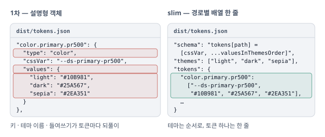

# 토큰 카탈로그를 설명형 JSON 에서 slim JSON 으로

AI 에이전트가 읽을 토큰 카탈로그 `dist/tokens.json` 을 설명형 객체 대신 경로별 배열 한 줄로 냄. 첫 설명형 카탈로그는 `d.ts` 보다 오히려 무거웠음.

## 상황

- 가설 — AI 가 여러 `d.ts` 를 따라가며 읽는 것보다 모든 토큰을 평탄한 JSON 하나로 주면 더 가벼움
- 1차 카탈로그는 토큰마다 `type` · `cssVar` · `values: { light, dark, sepia }` 를 둔 설명형 객체. 사람이 읽기에는 분명함
- 재 보니 오히려 무거워짐(작성자 측정, 이 수치는 커밋되지 않음)

| 시나리오             | tokens | baseline 대비 |
| -------------------- | ------ | ------------- |
| baseline `d.ts` 8개  | 19,218 | —             |
| with-catalog(설명형) | 35,049 | +82.4%        |
| catalog-only(설명형) | 34,795 | +81.1%        |

## 판단

무거운 이유는 반복 — AI 가 이해하는 데 꼭 필요한 정보만 남김.

- **원인은 반복** — `type` · `cssVar` · `values` 키와 `light` · `dark` · `sepia` 테마 키가 토큰마다 되풀이되고, 객체 구두점과 `JSON.stringify(_, null, 2)` 들여쓰기가 줄 수를 크게 늘림
- **`d.ts` 는 생각보다 효율적** — 비슷한 구조가 반복돼 BPE 토크나이저가 재사용할 패턴이 많음. 사람이 읽기 좋은 설명형 JSON 은 토큰 관점에서 반복 비용이 큼
- **AI 가 이해하는 데 꼭 필요한 정보만 남김**
  - **`type` 제거** — `color.primary.pr500` 처럼 경로 첫 값으로 카테고리를 알 수 있음
  - **객체를 배열로** — 테마 이름을 매번 쓰지 않고 `themes` 순서로 값을 읽음
  - **직렬화를 짧게** — 토큰 하나를 한 줄 배열로
    

**"카탈로그면 가볍다"가 아니라 "AI 가 읽기 좋게 충분히 단순해야 가볍다" — 같은 정보가 표현에 따라 2배 넘게 차이 남(35K → 15K).**

## 반영

- **형식** — `genCatalog.ts` 가 slim `dist/tokens.json` 을 냄: `{ "schema": "tokens[path] = [cssVar, ...valuesInThemesOrder]", "themes": [...], "tokens": { "<path>": ["--ds-…", "<light>", …] } }`. 작성자 기록으로 파일 크기는 약 113KB 에서 45KB
- **측정** — 이틀 뒤 측정 스크립트를 커밋하며 slim 결과를 남김([측정 기록](2026-05-09-token-measurement-tools.md))

| 시나리오     | tokens | baseline 대비 |
| ------------ | ------ | ------------- |
| baseline     | 19,311 | —             |
| with-catalog | 15,144 | −21.6%        |
| catalog-only | 14,890 | −22.9%        |

## 검증

- 위 slim 표는 측정 스크립트 README 의 OpenAI gpt-4o(tiktoken) 출력. 작성자 메모의 slim 수치는 baseline 19,218 기준 −21.2% · −22.5% 로, 측정 시점이 달라 조금 다름

## 참고자료

- [tiktoken](https://github.com/openai/tiktoken) — OpenAI. OpenAI 모델용 BPE 토크나이저. 이 기록의 수치는 이 토크나이저(gpt-4o)로 셈
