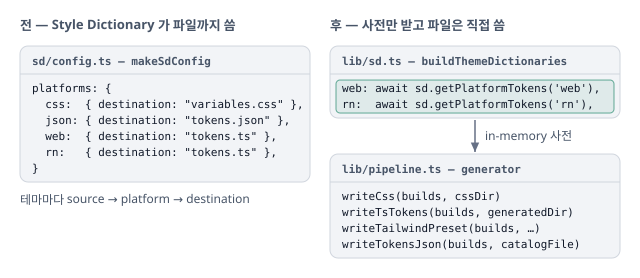

# Style Dictionary 를 file output 없이 변환 파이프라인으로만 사용

Style Dictionary 의 `destination` 기반 file output 을 걷어내고, in-memory 토큰 사전을 받아 각 generator 가 파일을 씀.

## 상황

- 2026-01-29 Style Dictionary 도입 때는 출력까지 맡김. `sd/config.ts` 의 `makeSdConfig` 가 테마별로 `variables.css` · `tokens.json` · `tokens.ts` 를 `destination` 으로 냄
- 실제로 필요한 출력 구조는 Style Dictionary 의 `source` · `platform` · `destination` 흐름과 조금 달랐음

## 판단

Style Dictionary 를 전체 build 시스템이 아니라 토큰 변환 파이프라인 라이브러리로 씀.

- **transform 과 format 이 나뉜 구조는 그대로** — 값을 어떻게 바꿀지와 결과를 어떤 형태로 낼지를 따로 다룸
- **file output 은 쓰지 않음** — `getPlatformTokens` 로 in-memory 사전만 받고, 파일은 generator 가 직접 씀. 새 출력은 generator 하나를 더하면 됨

**도구의 기능을 전부 쓰지 않고 필요한 부분만 — 출력은 직접 제어.**

## 반영

- **in-memory 사전** — `destination` 출력을 지우고, `buildThemeDictionaries` 가 테마마다 `getPlatformTokens('web' | 'rn')` 로 사전을 만듦
- **generator** — `build.ts` 가 그 사전을 CSS · Web/RN TS 토큰 · Tailwind preset · `tokens.json` generator 에 넘김. `dist/tokens.json` 은 이때 더한 새 출력([build 방식 기록](2026-01-29-design-tokens-build.md))

## 검증

- 지금 산출물은 `design-tokens-vitest` 가 확인함

## 참고자료

- [Architecture](https://styledictionary.com/info/architecture/) — Style Dictionary. transform 은 토큰 값을 바꾸는 단계, format 은 끝난 토큰을 파일 형태로 내는 단계로 나뉨
- [getPlatformTokens](https://styledictionary.com/reference/api/#getplatformtokens) — Style Dictionary API. 플랫폼 transform 과 참조 해석을 마친 토큰을 객체 · 평탄 배열로 돌려줌. 파일을 쓰지 않음
