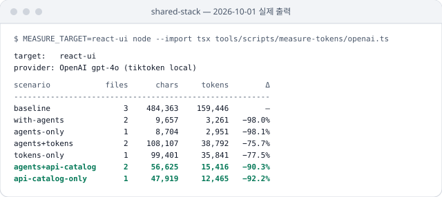

# AI 토큰 절감을 직관 대신 토크나이저로 측정

패키지를 AI 에이전트가 읽을 때 드는 input 토큰을 시나리오별로 세는 `tools/scripts/measure-tokens` 를 둠. OpenAI · Anthropic 두 토크나이저로 같은 시나리오를 잼.

## 상황

- "여러 `d.ts` 보다 평탄한 JSON 하나가 가볍다"는 직관적으로는 맞아 보였음
- AI 가 실제로 치르는 비용은 파일 크기나 사람이 느끼는 복잡도가 아니라 모델의 토크나이저가 어떻게 쪼개는지에 달림. 감으로 판단할 문제가 아님
- 실제로 첫 설명형 카탈로그는 baseline 보다 80% 넘게 무거웠음([기록](2026-05-07-slim-token-catalog.md))

## 판단

절감은 감이 아니라 토크나이저로 잼.

- **재현 가능한 측정을 코드와 함께 둠** — AI 토큰 절감을 주장하려면 측정 인프라가 있어야 함. 측정할 수 없는 절감은 감에 가까움
- **두 토크나이저를 모두 씀** — 모델마다 BPE 어휘가 달라 한쪽에서 줄었다고 다른 모델에서도 준다는 보장이 없음

| 도구                         | 기본 모델           | 비용                                 | 특징                              |
| ---------------------------- | ------------------- | ------------------------------------ | --------------------------------- |
| `tiktoken`                   | `gpt-4o`            | 0(로컬)                              | 로컬에서 바로 잼. CI 에 넣기 좋음 |
| Anthropic `count_tokens` API | `claude-sonnet-4-6` | 무료(분당 요청 수 제한, API 키 필요) | 실제 운영 모델 기준으로 확인      |

- 작성자 측정으로 slim 카탈로그의 절감은 두 모델 모두 약 21~22% 로 비슷함

## 반영

- **측정 스크립트** — `tools/scripts/measure-tokens` 의 `all.ts`(두 모델 한 표) · `openai.ts` · `claude.ts`. target 은 design-tokens · ui-core · react-ui · react-native-ui
- **시나리오 등록부** — 처음에는 `shared.ts`, 이후 `registry.ts` 로 옮겨 품질 관측 수집기와 같은 시나리오 · 이어 붙이기를 씀

## 검증

- 지금 등록부는 `registry.test.ts`(`pnpm tools:check`)가 고정함

## 참고자료

- [tiktoken](https://github.com/openai/tiktoken) — OpenAI. OpenAI 모델용 BPE 토크나이저
- [Token counting](https://platform.claude.com/docs/en/build-with-claude/token-counting) — Claude Docs. 메시지를 보내기 전에 입력 토큰 수를 셈. 무료이고 분당 요청 수 제한이 있음. 수는 추정치이고, Claude Opus 4.7 부터 새 토크나이저라 같은 글도 약 30% 더 셈
