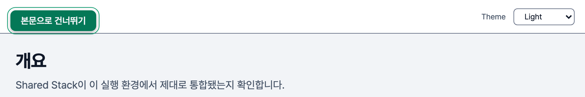

# SkipLink — 반복 블록을 건너뛰어 본문으로 가는 링크

react-ui 에 `SkipLink` 를 더함. 평소에는 화면에서 숨고 키보드 포커스를 받을 때만 드러나며, 누르면 본문(`<main>`)으로 감.

## 상황

- 마우스 사용자는 원하는 곳을 바로 누르지만 키보드 사용자는 Tab 으로 차례대로 감. 헤더 · 사이드바에 링크가 많으면 본문까지 수십 번 Tab 이 필요함
- WCAG 2.1 성공 기준 2.4.1 Bypass Blocks(Level A) — 여러 페이지에 반복되는 블록을 건너뛸 수단을 줘야 함. Level A 는 최소 요구라 접근성을 지키는 사이트면 반드시 구현함

## 판단

평소에는 숨기고, 키보드 포커스를 받을 때만 드러냄.

- **포커스를 받을 때만 보임** — 마우스로는 안 보이는 것이 정상. 키보드 사용자는 볼 수 있어야 있는 줄 앎
- **숨길 때 접근성 트리에서 빼지 않음** — `display: none` · `visibility: hidden` 은 스크린 리더와 키보드에서도 사라짐. 시각적으로만 숨기는 sr-only 방식을 씀

| 방식                     | 화면           | 스크린 리더 | 키보드 포커스 |
| ------------------------ | -------------- | ----------- | ------------- |
| `display: none`          | 숨김           | 숨김        | 불가          |
| `visibility: hidden`     | 숨김           | 숨김        | 불가          |
| sr-only                  | 숨김           | 노출        | 가능          |
| sr-only + 포커스 때 해제 | 포커스 때 노출 | 노출        | 가능          |

- **동작 순서**
  - 첫 Tab — skip link 가 좌상단에 나타남
  - Enter — 본문으로 이동하고, 다음 Tab 은 본문 첫 요소부터
  - Enter 없이 Tab — skip link 가 다시 숨고 다음 포커스 대상으로
- **대상은 `<main>`** — `main` 랜드마크라 스크린 리더가 주요 콘텐츠로 인식함

## 반영

- **컴포넌트** — react-ui `SkipLink`(skip-to-content 앵커). `targetId` 로 `href="#<id>"` 를 만듦
- **숨김 · 드러냄** — Tailwind 유틸이 아니라 `skip-link.scss` 가 함. 평소 1px · `clip` 으로 숨기고 `:focus` · `:focus-visible` 에서 풂
  - **`z-index: 50`** — 드러난 링크가 열린 목록(`select` · `search-field` 의 `10`) 위에 떠야 함
  - **outline 과 그림자를 함께** — forced-colors 는 `box-shadow` 를 지우므로 그림자만으로는 포커스 표시가 사라짐. `.ui-button:focus-visible` 과 같은 전략
- **대상** — demo-web `AppShell` 이 `<SkipLink targetId="main">` 과 `<main id="main" tabIndex={-1}>` 를 씀. `tabIndex={-1}` 이라 이동하면 `main` 이 포커스를 받음

## 검증

- `SkipLink.test.tsx` 가 링크 역할 · `targetId` 로 만든 `href` · 속성 전달을 확인함

## 참고자료

- [Understanding SC 2.4.1: Bypass Blocks](https://www.w3.org/WAI/WCAG21/Understanding/bypass-blocks.html) — W3C WAI. Level A. 여러 페이지에 반복되는 블록을 건너뛸 수단을 둠. 방법으로 페이지 맨 위의 본문 링크 · 랜드마크 등
- [Skip Navigation Links](https://webaim.org/techniques/skipnav/) — WebAIM. 평소 숨기고 포커스 때 눈에 띄게 드러냄. 누르면 대상이 실제로 포커스를 받아야 이어서 탐색할 수 있음
- [`<main>`](https://developer.mozilla.org/en-US/docs/Web/HTML/Reference/Elements/main) — MDN. 문서당 하나, 암묵적 `main` 랜드마크. `id` 를 달아 skip link 의 대상으로 씀
- [Screen-reader only](https://tailwindcss.com/docs/display#screen-reader-only) — Tailwind CSS. `sr-only` 는 시각적으로만 숨기고 스크린 리더에는 남김. `not-sr-only` 로 되돌림
