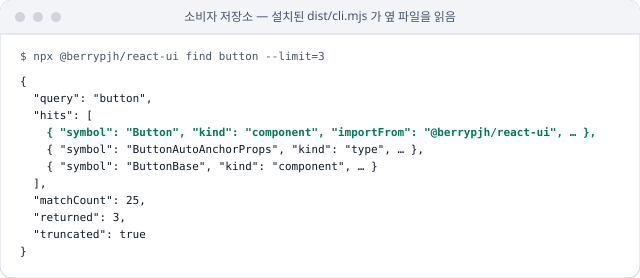

# UI 조회를 MCP 도구가 아니라 CLI로 제공

consumer-retrieval resolver를 소비자에게 MCP 도구로 열지 않고, 패키지에 동봉한 CLI(`npx @berrypjh/react-ui find|api|token`)와 `pnpm ui:lookup`으로만 제공. `plugins/berry-commit`에 UI 조회를 섞지 않고, 별도 UI plugin도 만들지 않음.

## 상황

- **resolver 추가** — platform → package → 심볼 → 토큰으로 좁히는 결정적 resolver를 `tools/consumer-retrieval`에 추가(`6ff3497`)
- **배포 형태 선택** — 소비자 에이전트가 이 resolver를 부를 방법으로 MCP 도구와 CLI 중 하나를 고름
- **기존 plugin** — `plugins/berry-commit`은 commit 도메인만 다룸

## 판단

MCP 도구를 먼저 만들지 않고, 패키지에 동봉한 CLI 로 조회를 줌.

- **효과 측정 불가** — live executor가 없어 MCP 도구가 retrieval을 개선하는지 보일 방법이 없음. 검증되지 않은 인프라를 먼저 만들지 않음
- **이득은 초기 컨텍스트에서 나옴** — full `.d.ts`와 full `tokens.json`을 빼고 카탈로그를 넣는 것만으로 컨텍스트가 크게 줄어듦(`pnpm eval:consumer:context`). tool surface가 아니라 "무엇을 읽히는가"의 문제
- **소비자 경로 미해결** — 소비자 저장소에는 `tools/`가 없고 `node_modules/@berrypjh/*/dist/{llm-catalog,tokens}.json`만 있음. plugin이 그 경로를 찾는 로직은 별도 작업이고, eval harness가 그 경로를 검증하지 않음
- **CLI로 충분** — 필요한 것은 Bash에서 부를 수 있는 조회. 패키지에 CLI를 동봉하면 설치된 `dist` 옆 파일을 읽어 경로 문제도 없음
- **다시 검토할 조건** — live executor 실행에서 Progressive Retrieval 에이전트가 안내에도 불구하고 full `tokens.json`이나 full 카탈로그를 반복해서 읽는 것이 관측될 때. 그때 `plugins/berry-ui`를 별도 도메인으로 만들고 `berry-commit`에 섞지 않음

## 반영

- **패키지 CLI** — `tools/consumer-retrieval/package-cli.ts`. react-ui build 가 `dist/cli.mjs` 로 묶어 `npx @berrypjh/react-ui find|api|token` 으로 부름
- **저장소 안 조회** — `tools/consumer-retrieval/cli.ts` 의 `pnpm ui:lookup`
- **만들지 않은 것** — MCP 서버 · UI plugin

## 검증

- `tools/consumer-retrieval/*.test.ts` — resolver 단계와 패키지 CLI를 고정. `pnpm tools:check`가 실행
- `tools/consumer-retrieval/package-cli.test.ts` — 두 패키지 README가 에이전트 안내(`AI 에이전트용` · `llm-catalog.json` · `npx <패키지> api`)를 담는지 확인
