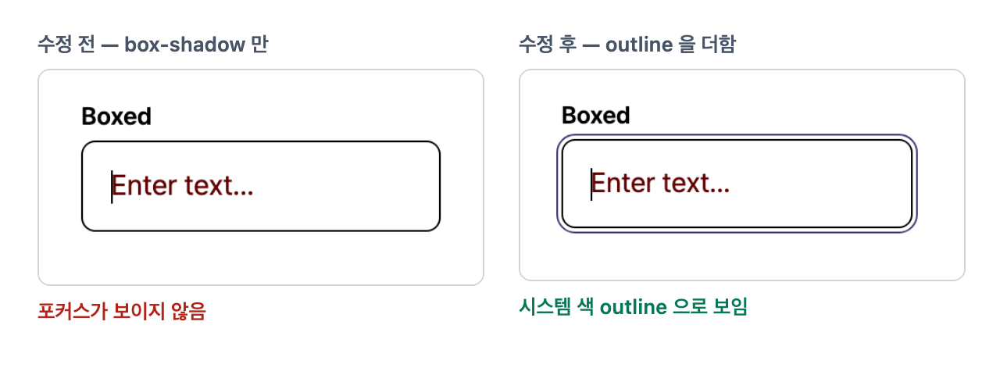

# react-ui 입력 상태 우선순위를 선언 순서에서 떼고 forced-colors 포커스를 복구

입력 · 라벨 · 헬퍼의 상태 규칙에 `:not()` 을 붙여, 상태가 겹쳐도 규칙 하나만 걸리게 함. 그래서 `disabled > error > focused` 가 선언 순서나 특정도에 좌우되지 않음. forced-colors 에서 사라지던 box-shadow 포커스 링에 outline 을 더함.

## 증상

- disabled · error · focused 가 겹칠 때 어느 색이 이길지가 SCSS 선언 순서와 특정도에 달려 있어, 목표 순서가 보장되지 않음
- Windows 고대비(forced-colors) 모드에서 입력 · 버튼의 포커스 링이 보이지 않음
- `plain-input` 은 disabled 밑줄 색이 비어 있었음



## 원인

겹친 상태에 규칙이 여럿 걸렸고, 포커스는 고대비 모드가 지우는 속성으로만 그렸음.

- 상태가 겹치면 규칙도 함께 걸려, 어느 색이 이길지가 선언 순서와 특정도에 달려 있었음
- forced-colors 는 저자 색을 시스템 색으로 바꾸고 `box-shadow` 를 지움(CSS Color Adjust 1). 포커스를 box-shadow 로만 그린 규칙은 그 모드에서 통째로 사라짐

## 반영

- **상태 우선순위** — 입력 세 variant · `input-label` · `form-helper-text` SCSS 의 상태 규칙에 `:not()` 을 붙여 겹친 상태에서도 하나만 걸리게. `disabled > error > focused` 가 선언 순서 · 특정도와 무관
- **forced-colors 포커스** — box-shadow 포커스 규칙마다 `@media (forced-colors: active)` outline, contained 버튼에 `ButtonBorder` 경계
- **검사 도구** — `libs/react-ui/test/componentStyles.ts` 가 SCSS 를 실제로 컴파일해 매칭되는 상태 규칙만 검사
- **문서** — `libs/react-ui/AGENTS.md` Gotcha "forced-colors에서 `box-shadow`는 렌더되지 않는다"

상태 우선순위 예 — `input-label.scss`(`d49f9f7`)

```scss
/* 전 — focused 는 클래스 둘이라 특정도가 높아 disabled · error 를 모두 이김.
   disabled 와 error 는 특정도가 같아 뒤에 선언한 error 가 이김 */
.ui-input-label--focused.ui-input-label--color-primary {
  color: var(--ds-text-primary);
}
.ui-input-label--disabled {
  color: var(--ds-text-disable);
}
.ui-input-label--error {
  color: var(--ds-text-error);
}

/* 후 — 자기보다 센 상태가 함께 있으면 걸리지 않음.
   실제 파일은 한 줄 선택자이고, 여기서는 같은 선택자를 & 로 풀어 씀 */
.ui-input-label--focused.ui-input-label--color-primary {
  &:not(.ui-input-label--disabled):not(.ui-input-label--error) {
    color: var(--ds-text-primary);
  }
}
.ui-input-label--error:not(.ui-input-label--disabled) {
  color: var(--ds-text-error);
}
.ui-input-label--disabled {
  color: var(--ds-text-disable);
}
```

## 검증

- `forcedColors.test.ts` — box-shadow 포커스 규칙에 forced-colors 대응이 있는지 규칙 자체를 검사. variant 를 더하면 목록 수정 없이 걸림
- `inputVariantStates.test.ts` · `InputLabel.test.tsx` · `FormHelperText.test.tsx` — 목표 순서는 RN 리졸버와 같음
