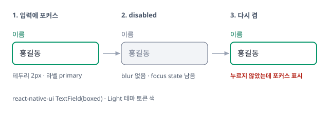

# RN 입력이 disabled 를 지나면 예전 focus 표시가 되살아나던 문제

`disabled ? false : focused` 처럼 파생값으로 가리기만 해서, disabled 동안 남은 로컬 focus 상태가 다시 켤 때 드러남. disabled 가 되면 상태 자체를 비우도록 수정.

## 증상

- 포커스된 입력을 disabled 로 바꿨다가 다시 켜면, 사용자가 누르지 않았는데 포커스 표시(테두리 · 라벨 색)가 켜진 채로 돌아옴
- FormControl 안(09-10)과 FormControl 밖의 InputBase 단독(09-11) 두 경로에서 각각 나타남

## 원인

disabled 는 focus 표시를 화면에서만 가리고, 상태는 그대로 남김.

- focus 는 로컬 state 로 남아 있고, disabled 는 그 값을 화면에서만 가림
- disabled 동안 blur 이벤트가 오지 않으니 state 가 true 로 남고, disabled 가 풀리는 순간 그대로 보임

## 반영

disabled 가 되면 상태 자체를 비움.

- `FormControl` — disabled 가 되면 `useEffect` 로 내부 focus 상태를 비움. context 참조 안정성 테스트 추가
- `InputBase` — FormControl 밖에서는 InputBase 가 상태 소유자. disabled 가 참일 때만 `focusedState` 를 비워 autoFocus 초기 포커스 알림은 보존

## 검증

- `FormControl.test.tsx` — "disabled 를 켰다 끄면 내부 focus 상태가 남지 않는다"
- `FormControl.integration.test.tsx` — disabled 가 실제 TextInput 을 잠금
- `pnpm nx test @berrypjh/react-native-ui`. 기기에서의 확인은 demo-mobile Form 섹션
