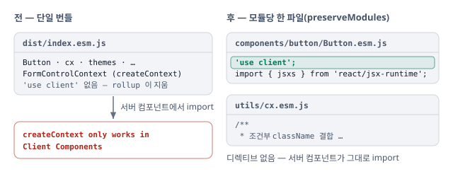

# RSC 서버에서 client 모듈이 평가되지 않도록 dist 에 'use client' 를 보존

rollup 이 지우는 모듈 디렉티브를 `preserveModules` 와 `banner` 로 청크 1행에 되돌림. 서버 컴포넌트에서 그대로 쓰는 모듈(`cx` · `themes` · `Web` · `ThemeProvider` · `VisuallyHidden`)은 디렉티브 없이 둠.

## 증상

- Next.js App Router 의 서버 컴포넌트에서 `@berrypjh/react-ui` 를 import 하면 `createContext only works in Client Components` 로 깨짐
- 소스에는 `'use client'` 가 있지만 dist 에는 없음. rollup 은 모듈 최상단 디렉티브를 지우고 `Module level directives cause errors when bundled` 경고만 냄
- 디렉티브를 되살려도 dist 가 단일 번들(`index.esm.js`) 한 파일이라, 붙이면 서버용 모듈까지 전부 client 가 됨

## 판단

단일 번들을 모듈마다 한 파일로 쪼개, 디렉티브를 필요한 파일에만 붙임.

| 판단                                  | 이유                                                                                                                             |
| ------------------------------------- | -------------------------------------------------------------------------------------------------------------------------------- |
| **모듈당 한 파일**(`preserveModules`) | dist 가 소스 구조 그대로라 디렉티브를 모듈마다 따로 붙일 수 있음. 서버에서 쓰는 모듈은 디렉티브 없는 파일로 남음                 |
| **디렉티브는 `banner` 로 첫 줄에**    | `transform` 에서 `'use client'` 로 시작하는 모듈을 기록하고, 그 모듈이 든 청크에만 붙임. banner 는 output option 이라 항상 첫 줄 |

**client 가 필요한 파일만 client — 서버 컴포넌트는 디렉티브 없는 모듈을 그대로 import 함.**

## 반영

- **모듈당 한 파일 · banner** — `libs/react-ui/rollup.config.cjs` 의 `clientDirective()`(`plugin` · `banner`)와 output 의 `preserveModules` · `preserveModulesRoot`
- **소비자 문서** — `libs/react-ui/AGENTS.consumer.md` TL;DR 에 서버에서 import 할 수 있는 범위, `libs/react-ui/AGENTS.md` Gotcha 에 디렉티브 규칙

## 검증

- `head -1 libs/react-ui/dist/components/button/Button.esm.js` 가 `'use client';`, `dist/utils/cx.esm.js` 는 주석으로 시작
- 저장소 안에 RSC 소비자가 없어 서버 렌더 자체를 확인하는 자동 테스트는 없음. 실제 확인은 Next.js 소비 저장소에서
