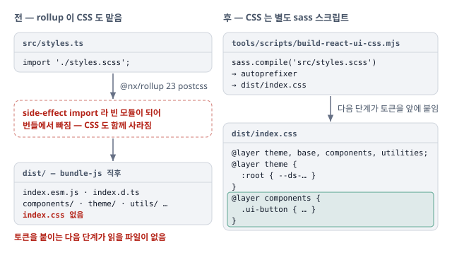

# react-ui 의 dist/index.css 를 rollup postcss 대신 별도 sass 스크립트로 생성

`@nx/rollup` 23 으로 올린 뒤 `dist/index.css` 가 나오지 않음. CSS 생성을 rollup 에서 떼어 `build-js` 의 별도 단계로.

## 증상

- 워크스페이스 업그레이드(Nx 23 · Vite 8) 뒤 `pnpm nx build @berrypjh/react-ui` 에서 컴포넌트 CSS 가 빠짐
- 같은 `@nx/rollup` 23.2.1 로 rollup 단계(`bundle-js`)만 돌리면 `dist` 를 비운 뒤 `dist/index.css` 를 아예 만들지 않음. CSS 관련 경고도 없음
- 그 뒤 토큰을 앞에 붙이는 단계는 `dist/index.css` 를 읽는데, 읽을 파일이 없음

## 원인

rollup 은 번들에 남는 모듈의 CSS 만 뽑는데, 스타일 진입점이 빈 모듈로 취급돼 번들에서 빠짐.

- `@nx/rollup` 23 의 내장 postcss 플러그인은 **번들에 포함된 모듈의 CSS 만** 추출
- `styles.ts` 의 `import './styles.scss'` 는 side-effect import 라 빈 모듈(`export default {}`)이 되고, rollup 이 번들에서 빼 버림. 그래서 CSS 도 함께 사라짐
- 직전 [cascade layer 결정](2026-09-15-react-ui-cascade-layers.md)으로 SCSS 로드가 `styles.scss` 한 파일로 모인 뒤라, 빠지는 것도 한 번에 빠짐

## 반영

CSS 생성을 rollup 에서 떼어, `build-js` 가 rollup 번들 뒤에 sass 스크립트를 따로 돌림.

- **CSS 스크립트** — `tools/scripts/build-react-ui-css.mjs` 가 `styles.scss` 를 sass 로 컴파일하고 autoprefixer 를 거쳐 `dist/index.css` 에 저장
- **build 순서** — `libs/react-ui/project.json` 의 `build-js` 가 `bundle-js`(rollup) → 이 스크립트 → ui-core 토큰을 `@layer theme` 으로 앞에 붙이는 단계 순으로 돎
- **의존성** — rollup 이 CSS 를 다루지 않으니 devDependency `rollup-plugin-postcss` 를 `autoprefixer` 로 교체
- **문서** — `libs/react-ui/AGENTS.md` 와 `src/index.ts` 주석의 CSS 생성 설명

## 검증

- `pnpm nx build @berrypjh/react-ui` 뒤 `dist/index.css` 첫 줄이 `@layer theme, base, components, utilities;` 이고 컴포넌트 규칙이 뒤따름
- `tools/lib/package-boundary.test.ts`(`pnpm tools:check`)가 export 대상과 소비자 산출물의 존재를 확인. 내용까지 보는 테스트는 없음
