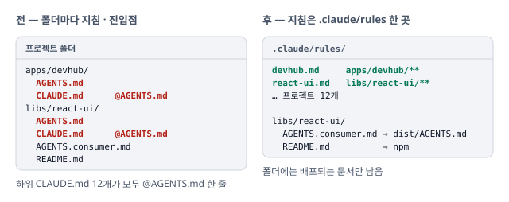

# 하위 프로젝트 지침을 path rule 로, 앱 설명을 docs 로 이동

앱 · lib 폴더마다 있던 `AGENTS.md` · `CLAUDE.md` · 앱 `README.md` 를 정리함. 에이전트 지침은 `.claude/rules/<프로젝트>.md`, 앱 설명은 `docs/` 한 곳에 둠. 저장소 밖으로 배포되는 문서(lib README · `AGENTS.consumer.md` · plugin)는 원본 옆에 그대로 둠.

## 상황

- **한 사실이 여러 자리에 있음** — 프로젝트 하나에 `AGENTS.md` · `CLAUDE.md` · `README.md` 가 있고, 저장소 전체 설계는 `docs/` 에 따로 있음. 같은 내용을 고칠 때 한 곳만 바뀌면 문서끼리 어긋남
- **진입점 중복** — 하위 `CLAUDE.md` 12개가 모두 `@AGENTS.md` 한 줄. 지침 파일이 두 겹이라 어느 쪽이 정본인지 폴더마다 다시 확인해야 했음

## 판단

한 사실은 한 자리 — 자리는 문서를 읽는 쪽이 정함.

| 판단                    | 이유                                                                                                                                                                           |
| ----------------------- | ------------------------------------------------------------------------------------------------------------------------------------------------------------------------------ |
| **한 사실은 한 자리**   | 불일치를 조심해서 고치는 것으로 막지 않고, 같은 사실이 두 곳에 적히지 않는 구조로 막음                                                                                         |
| **지침은 path rule 로** | path rule 도 그 경로의 파일을 열 때만 로드되어 하위 `AGENTS.md` 가 하던 일을 그대로 함. `.claude/rules/` 한 폴더에 모여 정본이 하나로 보이고, `CLAUDE.md` 진입점은 필요 없어짐 |
| **앱 설명은 docs 로**   | 앱은 전부 private 이라 README 가 npm 에 실리지 않음. quality-lab 사용법은 [usage.md](../observability/usage.md) 로 설계 문서 옆에 두어 겹친 내용이 한 폴더에 보이게 함         |
| **lib 도 지침은 옮김**  | 유지보수용 `AGENTS.md` 가 빠져 폴더에는 배포되는 두 문서만 남음. 비슷한 이름의 `AGENTS.md` · `AGENTS.consumer.md` 가 나란히 있던 혼동도 사라짐                                 |
| **devhub id 는 유지**   | `*-agents` · `*-readme` id 를 흐름 · 패키지 · 앱 화면이 인용함. 경로와 제목만 바꿈                                                                                             |

원본 옆에 남긴 문서

- **lib `README.md`** — npm 패키지 페이지. private 인 `design-tokens` · `ui-core` 도 `measure-tokens` baseline 시나리오가 소비자 문서로 측정함
- **`AGENTS.consumer.md`** — build 때 `dist/AGENTS.md` 로 복사되어 `./agents` export 로 소비자 AI 가 읽음
- **`plugins/*` · berry-dev standards** — 다른 저장소에 배포되는 원본. 공유 규칙의 "가장 가까운 `AGENTS.md`" 문구도 그대로 둠(루트 `AGENTS.md` 로 읽힘)

## 반영

- **`.claude/rules/`** — 프로젝트 12개 path rule(`demo-web` · `demo-mobile` · `devhub` · `devhub-e2e` · `quality-lab` · `quality-lab-e2e` · `design-tokens` · `devhub-ui` · `observability-contracts` · `react-ui` · `react-native-ui` · `ui-core`). 제목에 프로젝트 경로를 붙여 `src/…` 같은 상대 표기의 기준을 밝힘
- **진입점** — 하위 `CLAUDE.md` 12개 삭제
- **[AGENTS.md](../../AGENTS.md)** — 문서 자리 규칙(배포 문서는 원본 옆, 내부 지침은 `.claude/rules/`, 설명은 `docs/`)
